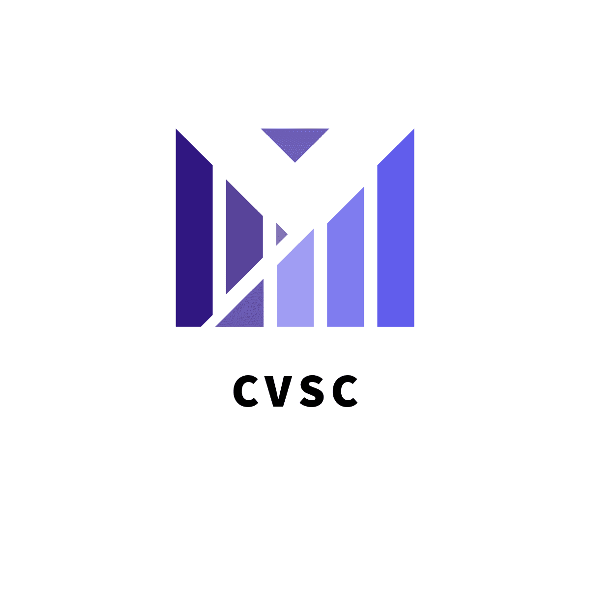
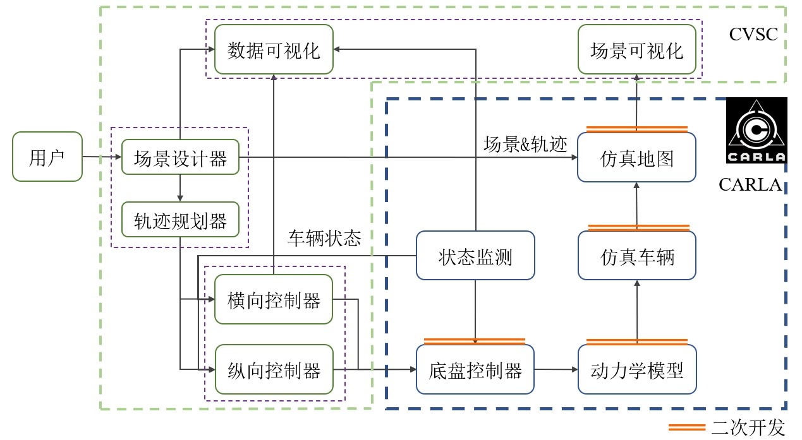
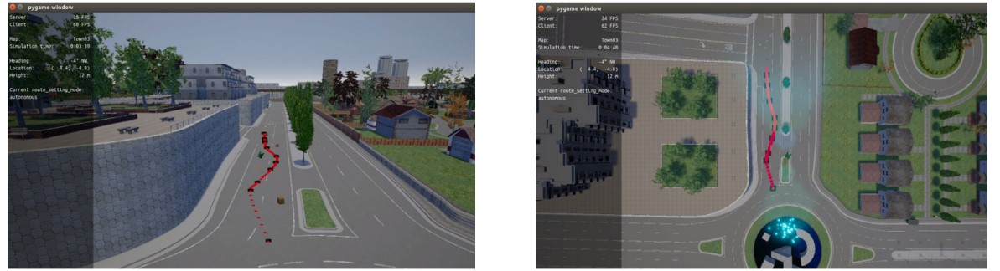
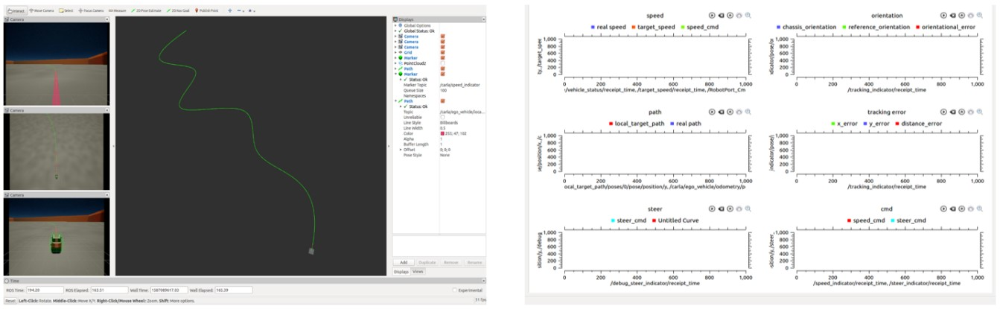
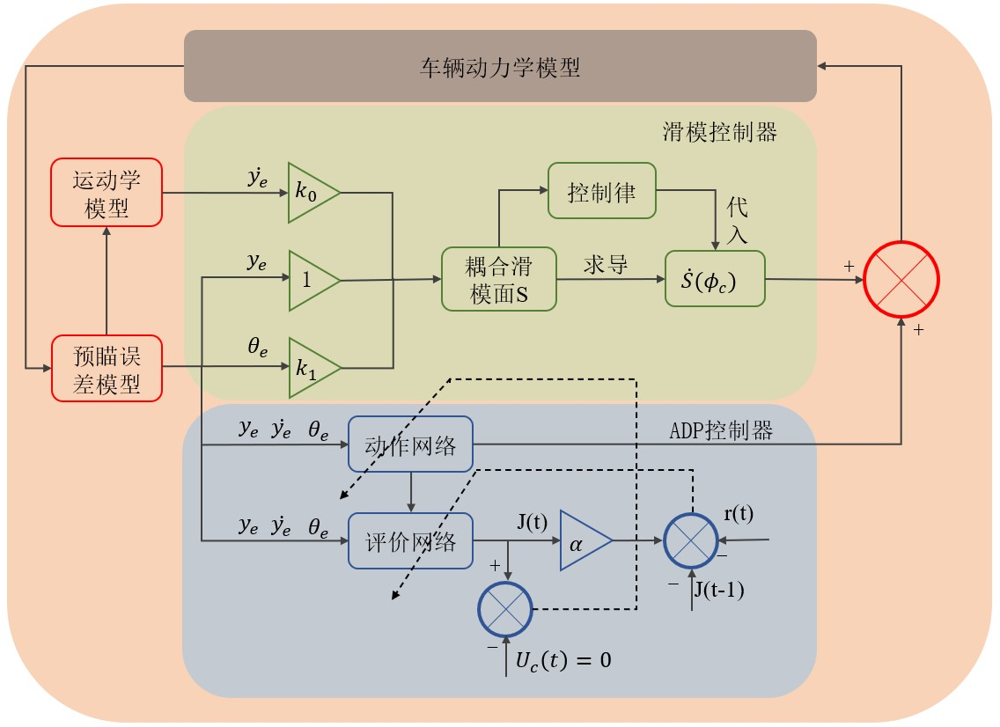
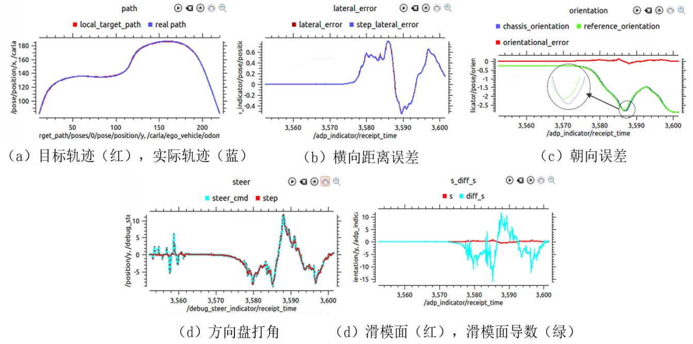

# CVSC: a Close-loop Vehicle Simulator For Control Based on Carla

[](https://github.com/TJ-Work/CVSC/actions)
[](https://docs.google.com/document/d/1gVRUaGxr5uluH6ehMqdeC0KJiINGeDPv/edit#)
[](https://github.com/TJ-Work/CVSC/blob/main/LICENSE.txt)
[](https://github.com/TJ-Work/CVSC/stargazers)

**[ 🏗 [Github Repo](https://github.com/TJ-Work/CVSC) | 📜 [Documentation](https://tj-work.github.io/CVSC-Simulator/) ]**

Welcome to CVSC! CVSC is a Close-loop Vehicle Simulator For Control Based on Carla. The product provides the following capabilities:

- 🎏 **New blank Map**: allow users to easily define the map and target trajectory.
- 📷 **Easy used visualization**: allow users to watch the preformance of controllers
- 🚀 **ADP-SMC controller**: improve the accuracy of smc controller using adp



## 🛠 Quick Start

0. Dependency

> [安装运行carla](http://carla.org)
>
> [安装运行ros](http://wiki.ros.org)
>
> [配置carla_ros_bridg](https://github.com/carla-simulator/ros-bridge) 
>
> [安装python simple pid 模块](https://github.com/carla-simulator/ros-bridge/tree/master/carla_ackermann_control)
>
> [multiplot画图工具](https://github.com/llove-y/rqt_multiplot_plugin)

1. export python environment

```
export PYTHONPATH=$PYTHONPATH:<path/to/carla/>/PythonAPI/<your_egg_file>
```

if you cannot find egg_file, try:

```
export PYTHONPATH="/home/owen/Music/CARLA_0.9.5/PythonAPI/carla/dist/carla-0.9.5-py2.7-linux-x86_64.egg:$PYTHONPATH"
export PYTHONPATH="/home/owen/Music/CARLA_0.9.5/PythonAPI/carla:$PYTHONPATH"
```

or you can add it to ~/.bashrc file

```
echo 'PYTHONPATH="/home/owen/Music/CARLA_0.9.5/PythonAPI/carla/dist/carla-0.9.5-py2.7-linux-x86_64.egg:$PYTHONPATH"' >> ~/.bashrexport 
```
2. run carla backend

``` 
cd ~/../CARLA_0.9.5  
./CarlaUE4.sh 或者 DISPLAY=  ./CarlaUE4.sh  
```

recommend use

```
DISPLAY= ./CarlaUE4.sh /Game/Carla/Maps/Town01 -benchmark -fps=10
```


3. design scenarios
```
python 3d_routes_and_obstacle_design.py
```
or:
```
python 2d_routes_design.py
```


4. Run CVSC
```
roslaunch carla_launcher assess_rambot_controller.launch
```
5. Run your own controller

```
roslaunch rambot_controller rambot_controller_simu.launch
```
6. Run plot

```
rqt_multiplot
```



## 🎶 ADP-Refined SMC controller
The framework of controller is shown in the following pic,


The simulation results:


For more details, please refer to my [paper](docs/bachelor_thesis.pdf).

## 🏫 Documentations

More information about CVSC can be found in [CVSC Documentation](https://tj-work.github.io/CVSC-Simulator/). 
Besides, the code of my [paper](docs/bachelor_thesis.pdf) can be found in [this repo](https://github.com/TJ-Work/CVSC).


[](https://github.com/TJ-Work/CVSC/graphs/contributors)
[](https://github.com/TJ-Work/CVSC/network)
[](https://github.com/TJ-Work/CVSC/issues)


