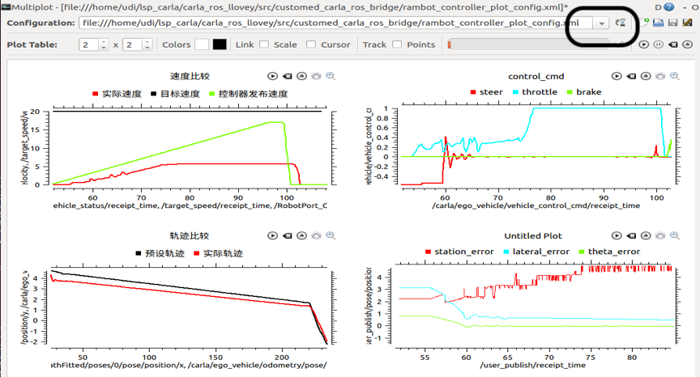

# Getting started with Carla_controller

## Dependency

> [安装运行carla](http://carla.org)
>
> [安装运行ros](http://wiki.ros.org)
>
> [配置carla_ros_bridg](https://github.com/carla-simulator/ros-bridge) 
>
> [安装python simple pid 模块](https://github.com/carla-simulator/ros-bridge/tree/master/carla_ackermann_control)
>
> [multiplot画图工具](https://github.com/llove-y/rqt_multiplot_plugin)

<table>
  <tr>
    <td bgcolor=#98FB98><font color="#FFFFFF"></font>！Important</font></td>
  </tr>
  <tr>
    <td bgcolor=#F0FFF0><font color="#FFFFFF"></font>1、carla_controller 要求 carla版本 0.9.5 及以上，适配的 ros_bridge 0.9.5.1</font></td>
  </tr>
  <tr>
    <td bgcolor=#F0FFF0><font color="#FFFFFF"></font>2、安装运行carla已经编译好的版本就行，不必要从源码构建</font></td>
   </tr>
在配置carla_ros_bridge 的过程中，需要将设置python环境命令；

```
export PYTHONPATH=$PYTHONPATH:<path/to/carla/>/PythonAPI/<your_egg_file>
```

在carla0.9.5 若找不到egg_file;可尝试如下命令

```
export PYTHONPATH="/home/owen/Music/CARLA_0.9.5/PythonAPI/carla/dist/carla-0.9.5-py2.7-linux-x86_64.egg:$PYTHONPATH"
export PYTHONPATH="/home/owen/Music/CARLA_0.9.5/PythonAPI/carla:$PYTHONPATH"
```

也可以将其添加到环境变量中

```
echo 'PYTHONPATH="/home/owen/Music/CARLA_0.9.5/PythonAPI/carla/dist/carla-0.9.5-py2.7-linux-x86_64.egg:$PYTHONPATH"' >> ~/.bashrexport 
```

carla_controller 主要由三个部分组成，包括scenario_designer、customed_carla_ros_bridge和rambot_controller。为了仿真您的控制器，您必须先运行carla服务端，这是所有操作的前提。scenario_designer 用来设计您需要的仿真路线及场景，customed_carla_ros_bridge是连接 carla world的桥梁，而rambot_controller则 是控制器的样品，展示了消息的接口，您可以仿照它定制自己的控制器。

## Usage

首先，设计您自己的场景，自由选择您需要的地图，并自定义路线，障碍物。

``` 命令行
cd ~/../CARLA_0.9.5   ## 进入到你自己下载的CARLA_0.9.*(版本号）文件夹下
./CarlaUE4.sh 或者 DISPLAY=  ./CarlaUE4.sh  ##运行可执行文件
```

推荐使用：

```
DISPLAY= ./CarlaUE4.sh /Game/Carla/Maps/Town01 -benchmark -fps=10
```

<table>
  <tr>
    <td bgcolor=#98FB98><font color="#FFFFFF"></font>！Note</font></td>
  </tr>
  <tr>
    <td bgcolor=#F0FFF0><font color="#FFFFFF"></font>该消息的含义如下：不进行图形显示，打开地形均为平面的Town01，将仿真帧率调到最低的10帧 可以根据这个格式更换地图，不打开显示的原因是，这个显示显示的是对整个地图的全局观测，
而不是对车子的观测，而且还会capture 鼠标，不如关掉显示。</font></td>
  </tr>
</table>

```
cd ~/../scenario_designer ##进入到你的scenario_desinger 文件夹下
python free_scenario_design.py
```

执行python脚本打开地图编辑视角后通过鼠标键盘自定义路线和线路图；操作方式如下

| 按键方式 | 作用 | 按键方式 | 作用                     | 按键方式    | 作用                                     |
| -------- | ---- | -------- | ------------------------ | ----------- | ---------------------------------------- |
| w        | 上   | c        | 选择放置物体或者路线模式 | 鼠标左键    | 物体模式下预览物体、路线模式下预览位置   |
| s        | 下   | 空格     | 删除上一次放置的物体     | 鼠标右键    | 物体模式放置物体，路线模式下设置waypoint |
| a        | 左   | Tab      | 切换摄像头视角           | o           | 切换设置路线模式决定路线是否经过waypoint |
| d        | 右   | r        | 记录数据                 | shift+R/Esc | 重启/退出                                |
|          |      |          |                          | i           | 生成采样点                               |

<table>
  <tr>
    <td bgcolor=#98FB98><font color="#FFFFFF"></font>！Note</font></td>
  </tr>
  <tr>
    <td bgcolor=#F0FFF0><font color="#FFFFFF"></font>注意设置路线点后，需要press i 生成一系列采样点；之后按r保存数据</font></td>
  </tr>
</table>

设置按r保存数据, 并新开一个终端，cd到上述文件夹下

```
python csv_to_xml_helper.py route input_file_name output_file_name
```

- input_file_name ：与csv_to_xml_helper.py在同一个文件夹下的 my_routes.csv
- outputfile_name:   自定义

配置文件会保存在output_xmls文件夹下,您需要将保存的your_config_name.xml中的内容复制到/carla_scenario_runner_ros/src/carla_scenario_runner_ros/srunner/configs/ControlAssessment.xml中；ControleAssessment中有多个场景；

<table>
  <tr>
    <td bgcolor=#98FB98><font color="#FFFFFF"></font>！Note</font></td>
  </tr>
  <tr>
    <td bgcolor=#F0FFF0><font color="#FFFFFF"></font>配置完场景，将运行中的free_scenario_design.py脚本退出; carla服务端可不退出，如果退出下一步操作中需要重新运行，配置中的路线标记会消息，但不影响控制仿真</font></td>
  </tr>
</table>

新开一个终端；运行下述命令，该launch文件将除了控制器的节点全部启动，场景已经准备完毕，等待控制器对小车进行控制；

```
roslaunch carla_launcher assess_rambot_controller.launch
```

新开一个终端；运行控制器

```
roslaunch rambot_controller rambot_controller_simu.launch
```

<table>
  <tr>
    <td bgcolor=#98FB98><font color="#FFFFFF"></font>！Note</font></td>
  </tr>
  <tr>
    <td bgcolor=#F0FFF0><font color="#FFFFFF"></font>当然，如果你想画图，我们也为你准备了一个开源的画图工具！想要画曲线图，请在仿真运行之前配置好参数！</font></td>
  </tr>
</table>

新开一个终端；运行；

```
rqt_multiplot
```



点击黑色区域从项目文件夹customed_carla_bridge/rambot_controller_config.xml 打开配置文件；点击导航栏的总运行按钮。即可画图；


