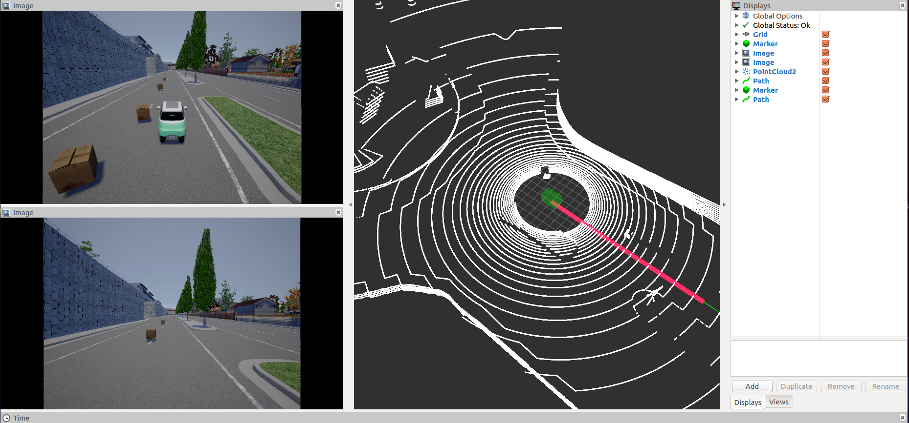
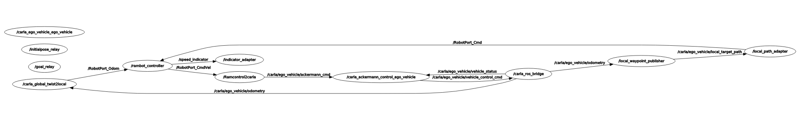

# carla_controller

## Introduction

Carla_controller 是由开源项目[carla](http://carla.org/)改进而成，以支持控制器的开发，仿真和验证。仿真平台支持在现有地图上自定义障碍物和路线，并实时观测控制效果等功能。

## Image

运行carla_controller 的界面如下(借用了ros的rviz)

## Instruction

carla_controller的ros_graph如下：

## [need_read](./need_read.md)

在使用carla_controller仿真平台前，您有必要先了解一下知识，因为他和我们平台的运行息息相关，或许可以帮助你解决一些疑问，请点击上方***[need_read](./need_read.md)***！

## [Getting started](./get_started.md)

现在你可以开始进行你的仿真了，点击上方***[Getting started](./get_started.md)***！

## Interpretation for some packages

1. ***[scenario designer](./scenario_designer.md)***
2. ***[carla_ros_bridge](./carla_ros_bridge.md)***
3. ***[carla_rambot_adapters](./carla_rambot_adapters.md)***
4. ***[other packages](./others.md)***

<table>
  <tr>
    <td bgcolor=#98FB98>！Important</td>
  </tr>
  <tr>
    <td bgcolor=#F0FFF0>we still have some "to do list"</td>
  </tr>
</table>

Here are some " ***[to do list](./to_do_list.md)***"
